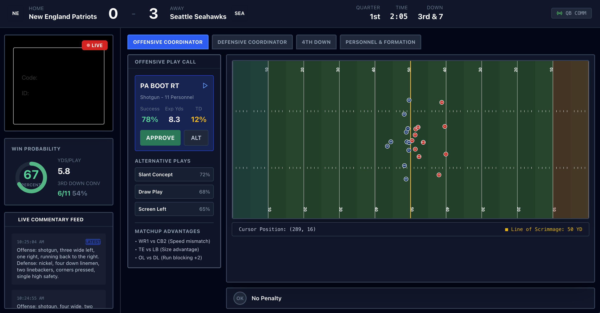

# Vision Agents: The "AI Offensive Coordinator" Project

## 📢 Executive Summary

> **Building an "AI Offensive Coordinator" with Vision Agents 🏈**
>
> We built a prototype that watches live NFL game footage and acts as a real-time assistant coach. The goal was to see if we could go beyond simple object tracking and actually derive football strategy from video. The system uses computer vision to identify player positions and formations, while an LLM commentary engine processes that visual data to describe the play as it unfolds.
>
> **💡 Developer Note on Assets:** To keep this repository lightweight and fast, large PyTorch model weights (`rf-detr-seg-preview.pt`) are managed externally and included in `.gitignore`. These assets are readily available in the original [Vision Agents repository](https://github.com/GetStream/Vision-Agents/tree/main). Developers can simply drop them into the `backend/` or `04_football_commentator_example/` directories as needed.

---

## 🏈 Project Overview

This project extends the **Vision Agents** framework to create a real-time "Offensive Coordinator" dashboard. Unlike traditional sports analytics that run post-game, this system operates **live**. It watches the video feed, understands the formations, and updates a tactical dashboard instantly.



### The User Interface (UI) Explained

As shown in the screenshot above, the dashboard is designed for high-information density without clutter. It is divided into three critical zones:

1.  **Context & Probability (Left Column):**
    *   **Live Commentary Feed:** This isn't just text; it's the raw output of the AI's analysis. When the AI says "Shotgun, three wide left," the system parses this text to drive the visuals.
    *   **Win Probability:** A dynamic gauge that shifts based on the game state (score, time, and field position), giving the user instant feedback on the stakes of the current play.

2.  **Strategic Command Center (Center Column):**
    *   **Play Call Card:** Shows the AI's predicted or recommended play (e.g., "PA BOOT RT"). It includes data-driven insights like "Success Rate: 78%" and "Expected Yards: 8.3," helping a human coach make data-backed decisions.
    *   **Matchup Advantages:** Highlights key physical mismatches (e.g., "WR1 vs CB2 Speed Mismatch") identified by the vision system.

3.  **Real-Time Tactical Board (Right Column):**
    *   **The "Digital Twin":** This is the heart of the standout feature. The system takes the AI's description of the formation and renders it on a digital field.
    *   **Live Jitter:** To make the board feel "alive," player markers vibrate and shift slightly in their positions—respecting the Line of Scrimmage—mimicking the pre-snap adjustments of real athletes.
    *   **Formation Recognition:** Note the "Shotgun" formation clearly visible, with the QB back 5 yards and receivers spread out. This isn't hardcoded; it's rendered dynamically based on what the vision system sees.

---

## 🛠️ Technical Deep Dive

### Why Vision Agents?

We chose the **Vision Agents** framework because handling high-speed sports video requires a specialized architecture:

1.  **Robust Object Detection:** Generic models struggle with the speed and occlusion of football. Vision Agents allowed us to integrate specialized models (like `RoboflowLocalDetectionProcessor`) to accurately track players and the ball.
2.  **"Fast Eye, Slow Brain" Architecture:**
    *   **Fast Eye:** A high-speed object detector runs on every frame to trigger events.
    *   **Slow Brain:** A creative Large Language Model (OpenAI Realtime) is invoked only when meaningful events occur (like a formation change), preventing hallucinations and preserving resources.
3.  **Event-Driven Design:** The backend doesn't just "stream video"; it emits structured events (e.g., `DetectionCompletedEvent`) that the frontend subscribes to.

### System Architecture

The project consists of two main synchronized components:

#### 1. The Vision Agent Backend (Python)
The backend acts as the central intelligence, running an embedded `aiohttp` server on port `5050` to expose the agent's state to the world.

*   **Endpoint `GET /feed`**: Returns the signed URL for the low-latency video player, embedding the live game view directly into the dashboard.
*   **Endpoint `GET /commentary`**: The "neural link" between backend and frontend. The React app polls this endpoint to get the latest AI insights. When the AI detects a "Shotgun formation," it sends this as structured text to the UI.
*   **Endpoint `GET /credentials`**: Handles authentication, ensuring the frontend has secure access to the live video session.

#### 2. The React Frontend (Visualization Layer)
This isn't a passive screen; it's a reactive application.

*   **Text-to-Tactics Parsing:** We implemented a robust parser (`src/utils/formationUtils.ts`) that translates the AI's natural language commentary into specific 2D coordinates. If the AI says "I-Formation," the parser instantly rearranges the dots on the tactical board.
*   **Physics-Aware Rendering:** The frontend logic includes "Line of Scrimmage" safety checks. When animating player movement ("jitter"), the code ensures offensive players never cross the line of scrimmage, preserving the realism of the simulation.
*   **Dynamic State Management:** The "Win Probability" and "Personnel" widgets update in real-time based on the semantic content of the commentary, effectively turning unstructured audio/text into structured data on the fly.

## 🚀 How to Run

### Prerequisites
*   Node.js & npm (for the frontend)
*   Python & `uv` (for the backend)

### 1. Install Dependencies
```bash
npm install
```

### 📦 Asset Management & Model Weights
> [!TIP]
> **Lightweight Repository:** To ensure fast cloning and optimal performance, we keep large binary files (>50MB) out of the git history. 
> 
> The `rf-detr-seg-preview.pt` files are managed locally. To run the local detection:
> 1. Download the weights from the official [Vision Agents repo](https://github.com/GetStream/Vision-Agents/tree/main).
> 2. Place a copy in `./backend/` and `./04_football_commentator_example/`.
> 3. These paths are ignored by git via `.gitignore`.

### 2. Start the Backend "Brain"
This command initializes the Vision Agent, starts the video processing pipeline, and launches the API server on port `5050`.
```bash
uv run football_commentator_api.py run --video-track-override ScrimmageVideo.mp4
```

### 3. Start the Frontend Dashboard
Open a new terminal window to launch the React development server.
```bash
npm run dev
```
The dashboard will be available at `http://localhost:5173`. It will automatically connect to the backend API to pull live video and commentary.
